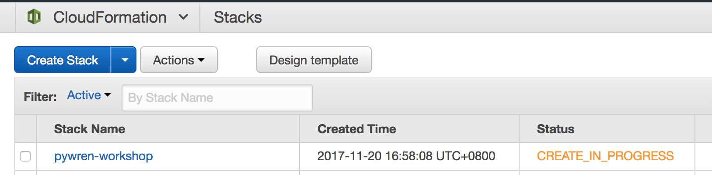
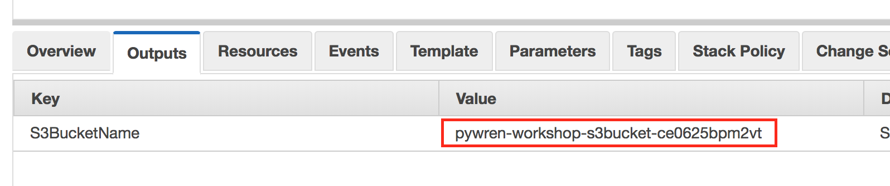
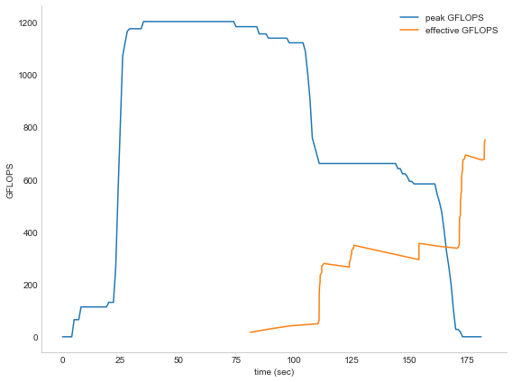
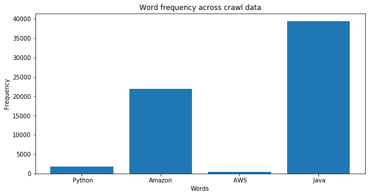
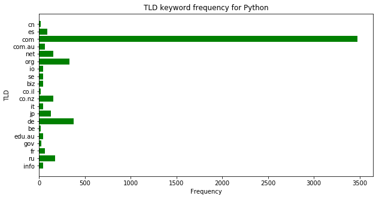
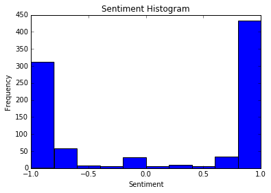
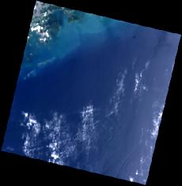
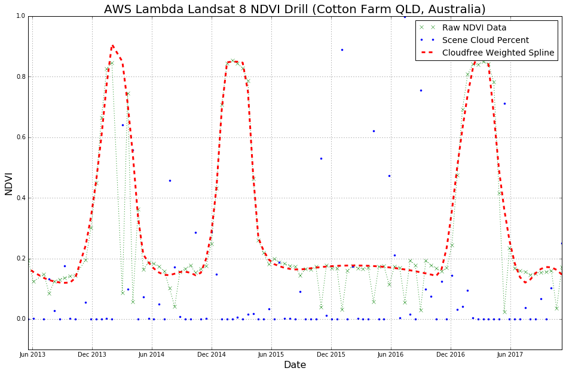

# Massive Parallel Data Processing using PyWren and AWS Lambda

## Overview

In this workshop we make use of a project called [pywren](http://pywren.io/) to run Python code in parallel at massive scale across [AWS Lambda](https://aws.amazon.com/lambda/) functions. The workshop is split into 4 different labs, that each individually address different use cases for [embarrassingly parallel](https://en.wikipedia.org/wiki/Embarrassingly_parallel) data processing tasks. We will make use of the [AWS Public Datasets](https://aws.amazon.com/public-datasets/), which hosts a variety of public datasets that anyone can access for free in the geospatial, environmental, genomics, life science and machine learning space. For the following 4 labs we will make use of the following datasets:

- [Common Crawl](https://aws.amazon.com/public-datasets/common-crawl/): A corpus of web crawl data composed of over 5 billion web pages
- [GDELT](https://aws.amazon.com/public-datasets/gdelt/): Over a quarter-billion records monitoring the world's broadcast, print, and web news from nearly every corner of every country, updated daily.
- [Landsat on AWS](https://aws.amazon.com/public-datasets/landsat/): An ongoing collection of satellite imagery of all land on Earth produced by the Landsat 8 satellite.

The 4 labs are split up as follows:

- **Hello World & Performance Benchmarking** - We will get comfortable with PyWren and execute basic Hello World examples, perform an analysis on potential TFLOPS we can get out of Pywren and then try to benchmark performance on reading and writing large amounts of files onto an Amazon S3 bucket in a massively parallel fashion and measure the throughput
- **Keyword Search** - We will use the [Common Crawl](https://aws.amazon.com/public-datasets/common-crawl/) dataset to search keywords against a large online corpus of crawled data. As the common crawl data is split up into smaller subset of crawls this present an ideal use-case for PyWren
- **Web Scraping with Sentiment Analysis** - We will use the [GDELT](https://aws.amazon.com/public-datasets/gdelt/) dataset to identify indexed news articles, extract relevant keywords, perform sentiment analysis and create tag cloud of frequently used words across news article
- **NDVI Calculation on Satellite Imagery** - We will use the [Landsat 8](https://aws.amazon.com/public-datasets/landsat/) satellite imagery to calculate a [Normalized Difference Vegetation Index (NDVI)](https://en.wikipedia.org/wiki/Normalized_Difference_Vegetation_Index) across multiple points of interests in the world, using the GeoTIFF data across multiple spectral bands

To execute the individual sections and visualize our outcomes we will make use of [Jupyter Notebooks](http://jupyter.org/), an open-source web application that allows to create and share documents that contain live code, equations, visualizations and narrative text. We will also make use of [AWS Cloudformation](https://aws.amazon.com/cloudformation/) to create the necessary AWS resources to store intermediary results. Please follow the below setup instructions first, before proceeding to the actual labs.

## Setup Environment

### AWS Services Setup

1\. Launch the CloudFormation stack that creates the basic setup by clicking on **Deploy to AWS** below.

**Oregon** (us-west-2) [](https://console.aws.amazon.com/cloudformation/home?region=us-west-2#/stacks/new?stackName=pywren-workshop&templateURL=https://s3.amazonaws.com/pywren-workshop/setup.yaml)

2\. This will launch the CloudFormation console and it should automatically load in the relevant CloudFormation YAML file. Click **Next**

3\. Provide your stack a name - we prepopulated this with **pywren-workshop**. We suggest you leave the default, unless you would have any conflicting CloudFormation stack in your account. Click on **Next**

4\. In this step you can define additional options, such as specifying Tags for your Stack or to launch it with a specific IAM role. We suggest that you leave the default settings and click on **Next**

5\. This will allow you to review the stack before launching it. Click on the **Create** button to launch the stack and create all the necessary AWS services. You should now see that your stack is being created:



6\. After the stack has successfully been created, click on `pywren-workshop` stack and click on the `Outputs` tab. Now copy down the S3BucketName, we will need it for later:



You can now proceed to setup our environment to make use of Jupyter Notebooks and PyWren

### Local Setup

For below labs we need to have Jupyter Notebook running locally, and make sure we got all the necessary Python libraries downloaded to visualize outputs.

1\. Install Jupyter Notebook on your laptop. _(Note: You can safely skip this step, if you have Jupyter Notebook with kernel of Python 2.7 installed on your machine)_ To do so, follow the instructions on <http://jupyter.org/install.html>. If you have `pip` installed, the easiest way to install Jupyter is by using pip. Please make sure to use **Python 2.7** and not Python 3+ for this workshop.

```
python -m pip install --upgrade pip
python -m pip install jupyter
```

2\. In addition to this, we need to install a variety of Python libraries. These libraries are used for visualization, processing of datasets and to also talk to AWS straight from Python using the [AWS SDK for Python](https://aws.amazon.com/sdk-for-python/). To do so, please execute the following commands:

```
python -m pip install boto3 warcio matplotlib numpy wordcloud nltk rasterio scipy seaborn awscli tldextract bs4 rio_toa
```

3\. In the last step, let's install the dependencies for PyWren and set it up locally on our machine.

```
python -m pip install pywren
```

4\. Pywren comes with an interactive setup process as of `v0.2`, let's use this to setup Pywren:

```
$ pywren-setup

This is the PyWren interactive setup script
Your AWS configuration appears to be set up, and your account ID is 123456789
This interactive script will set up your initial PyWren configuration.
If this is your first time using PyWren then accepting the defaults should be fine.
What is your default aws region? [us-west-2]:
Location for config file:  [~/.pywren_config]:
PyWren requires an s3 bucket to store intermediate data. What s3 bucket would you like to use? [jonas-pywren-604]:
Bucket does not currently exist, would you like to create it? [Y/n]: Y
PyWren prefixes every object it puts in S3 with a particular prefix.
PyWren s3 prefix:  [pywren.jobs]:
Would you like to configure advanced PyWren properties? [y/N]:
PyWren standalone mode uses dedicated AWS instances to run PyWren tasks. This is more flexible, but more expensive with fewer simultaneous workers.
Would you like to enable PyWren standalone mode? [y/N]:
Creating config /Users/olivierk/.pywren_config
new default file created in ~/.pywren_config
lambda role is pywren_exec_role_1
Creating bucket pywren-604.
Creating role.
Deploying lambda.
Pausing for 5 seconds for changes to propagate.
Pausing for 5 seconds for changes to propagate.
Successfully created function.
Pausing for 10 sec for changes to propoagate.
function returned: Hello world
```

5\. PyWren uses the default Python logger to communicate progress back. Let's raise our log level in the current terminal session to INFO:

```
export PYWREN_LOGLEVEL=INFO
```

6\. Time to test our Pywren function and see if our laptop can communicate appropriately with our AWS environment and use PyWren in the AWS Lambda function:

```
pywren test_function
```

You should now see an output similar to the following one:

```
2017-11-20 16:25:53,420 [INFO] pywren.executor: using serializer with meta-supplied preinstalls
2017-11-20 16:25:58,878 [INFO] pywren.executor: map f090f907-b44b-41e2-8c26-0a5ac9f45d72 00000 apply async
2017-11-20 16:25:58,880 [INFO] pywren.executor: call_async f090f907-b44b-41e2-8c26-0a5ac9f45d72 00000 lambda invoke
2017-11-20 16:26:00,499 [INFO] pywren.executor: call_async f090f907-b44b-41e2-8c26-0a5ac9f45d72 00000 lambda invoke complete
2017-11-20 16:26:00,534 [INFO] pywren.executor: map invoked f090f907-b44b-41e2-8c26-0a5ac9f45d72 00000 pool join
2017-11-20 16:26:13,760 [INFO] pywren.future: ResponseFuture.result() f090f907-b44b-41e2-8c26-0a5ac9f45d72 00000 call_success True
function returned: Hello world
```

7\. For the workshops we also need our PyWren function to write to DynamoDB. As such we need to provide the PyWren Execution IAM role the rights to write to DynamoDB. Go to [IAM console](https://console.aws.amazon.com/iam/home) and look up for **pywren_exec_role_1** role. Attach AWS managed policy **AmazonDynamoDBFullAccess**.

## Run the labs

We will use Jupyter Notebooks to locally run our experiments with Pywren and have the workload executed remotely. To do so, we first need to clone the repository for this workshop to our local machine:

```
git clone https://github.com/awslabs/pywren-workshops.git
```

Now enter the newly create `pywren-workshop` folder and start a Jupyter Notebook instance by typing the following command:

```
jupyter notebook
```

This will launch a Jupyter Notebook instance and open your web browser. You will find 4 folders that represents the respective labs. Please click onto the folder and launch the respective Notebook by clicking on the .ipynb file. The notebook itself will provide you with the instructions to complete the workshop.

## Outcomes

### Lab 1 - Hello World & Performance Benchmarking

We will run a performance benchmark across hundreds of parallel workers and analyze our measures TFLOPS throughput and will plot it accordingly:



We will use this across Amazon S3 and analyze how much throughput we can get on an S3 bucket with many parallel AWS Lambda functions:


### Lab 2 - Keyword Search

We will use the massive parallel nature of PyWren and AWS Lambda to analyze a large repository of the Common Crawl dataset and create statistics of certain keywords:



And also determine which top level domain has more frequent keyword mentions across the crawl:




### Lab 3 - Web Scraping with Sentiment Analysis

As part of the web scraping from news articles, we will use sentiment analysis and plot out the sentiment distribution across the news articles:



We proceed to analyse word frequencies across all news articles:


The distributed tag cloud processing of PyWren will create an output file with all tag clouds. It will look as follows:


### Lab 4 - NDVI Calculation on Satellite Imagery

We will query various scenes from the Landsat 8 satellite imagery and analyse them. Example scene:



We will then use the GeoTIFF imagery and it's different information to calculate the NDVI index and analyse how much cloud coverage we had on certain days:


Lastly we will plot NDVI changes over time for certain areas of interest of the world:


